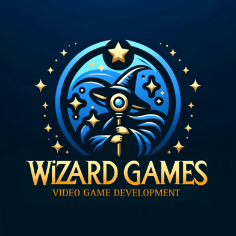

    

# Arham Quest - Game Design Document
Este documento documenta todas las decisiones tomadas en el desarrollo de Arham Quest. Los comentarios adicionales se reflejan en __negrita__, y las sugerencias en _cursiva_.

## Sinopsis
Eres el aprendiz de Arham, mago de los cuatro elementos en las tierras de Eldoria. Una mañana, Arham es raptado mientras entrenabas, y decides salir en su búsqueda. Así, viajas por una serie de mundos temáticos, aprendiendo habilidades con la ayuda de los magos que habitan en cada uno de ellos. Tras encontrarte con un Arham poseído, le liberas del hechizo y luchas contra el corrupto mago <nombre>, que está intentando controlar el mundo.

## Género
3D Hack and Slash en tercera persona con niveles de islas voladoras. Temática fantástica.

## Rango de edad
Arham Quest está destinado a jugadores de todas las edades.

## PEGI

    
    
PEGI 7

## Público objetivo
Buscamos jugadores casuales, que buscan un juego fácil para relajarse y entretenerse. Como es un juego para todas las edades, Arham Quest está pensado para que pueda disfrutarlo desde un adulto después de un día de trabajo hasta un niño de 10 años con sus padres.

## Niveles
Arham Quest sigue una progresión lineal en la que el jugador aprende habilidades a medida que visita los diferentes mundos.

Cada mundo es una colección de islas voladoras unidas entre sí, tematizadas con el elemento del mago que las habita. Los habitantes de cada mundo darán pequeñas misiones que el jugador deberá completar mientras se enfrenta a diferentes enemigos para que el mago le permita avanzar al siguiente nivel.

## Enemigos
Cada mundo tiene sus propios enemigos, generalmente una versión tematizada de los mismos tipos de enemigos.

### Demonio

* Vida: <?> puntos
* Ataques:
    - Golpe:
        * Daño: <?> puntos
        * Cooldown: <?>s
* Comportamiento: se acerca hacia el jugador y le golpea repetidamente.

### Esqueleto

* Vida: <?> puntos
* Ataques:
    - Golpe:
        * Daño: <?> puntos
        * Cooldown: <?>s
* Comportamiento: se acerca hacia el jugador y le golpea repetidamente.

## Mecánicas

* Andar.
    - Causa: El jugador presiona W, A, S y/o D.
    - Acción: El personaje se mueve en la dirección correspondiente.
* Correr.
    - Causa: El jugador presiona Shift mientras anda.
    - Acción: El personaje se mueve con mayor velocidad.
* Saltar.
    - Causa: El jugador presiona Espacio estando en una superficie.
    - Acción: El personaje salta <?>m.
    - Notas:
        * El salto tiene un cooldown de <?>ms desde que llega al suelo.
* Doble salto.
    - Causa: El jugador presiona Espacio en el aire tras saltar.
    - Acción: El personaje salta <?>m.
    - Notas:
        * Requiere haber saltado hace menos de <?>ms.
* Coger ítem. 
    - Causa: El personaje atraviesa un ítem flotante.
    - Acción: El personaje guarda el ítem en el inventario, y éste desaparece del nivel.
    - Notas:
        * _Mecánica destinada a recoger corazones, monedas..._
        * _El personaje tiene una capacidad limitada para coger algunos ítems (por ej.: corazones)._
* Abrir diálogo.
    - Causa: El jugador presiona E al estar en un radio de <?>cm de un NPC que ofrece un diálogo.
    - Acción: Se abre una ventana de diálogo y los controles de movimiento y la IA de enemigos se desactivan.
* Cerrar diálogo.
    - Causa: El jugador presiona ESC o Entrar tras haber completado un diálogo.
    - Acción: Se cierra la ventana de diálogo y los controles de movimiento y la IA de enemigos se activan.
* Ataque principal.
    - Causa: El jugador presiona Clic izquierdo.
    - Acción: El personaje utiliza el arma principal, o da un puñetazo en el caso de que no tenga arma.
* Ataque mágico.
    - Causa: El jugador presiona Clic derecho.
    - Acción: El personaje utiliza el hechizo seleccionado actualmente.

## Estilo artístico
Temática visual low-poly por la abundancia de recursos públicos y sencillez para crear nuevos assets. Cada nivel tiene una temática concreta (idílico, nevado…) 

### Personajes

Ejemplo del estilo. La imagen de la izquierda es un poco más detallada de lo que buscamos.

    
    
    
    

Enlaces de referencia:
* https://opengameart.org/content/animated-characters-pack
* https://poly.pizza/m/DgOCW9ZCRJ
* https://kaylousberg.itch.io/kaykit-adventurers
* https://poly.pizza/m/kttbFvCl2C

### Enemigos

    
    
    

Enlaces de referencia:
* https://poly.pizza/m/Iip30bDHmu
* https://kaylousberg.itch.io/kaykit-skeletons
* https://poly.pizza/m/LnfIziKv4o

### Niveles
Inspiración en “Sackboy: A big Adventure” y “Jak and Daxter: The Precursor Legacy”.

    
    

    
    

